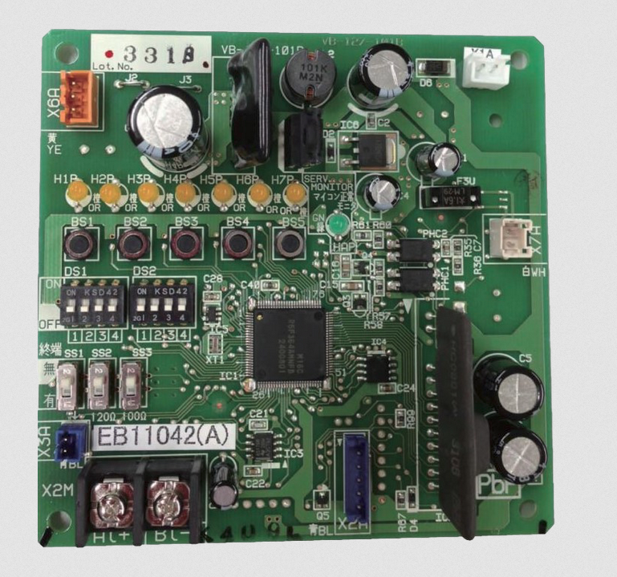
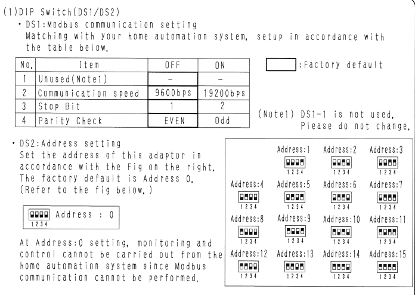
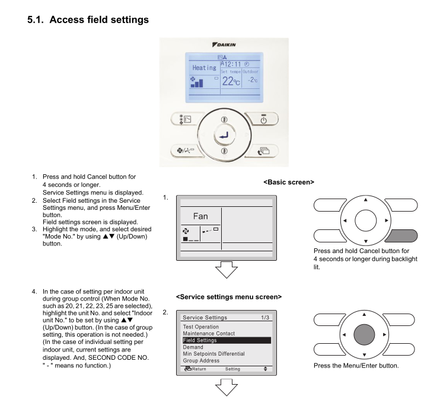
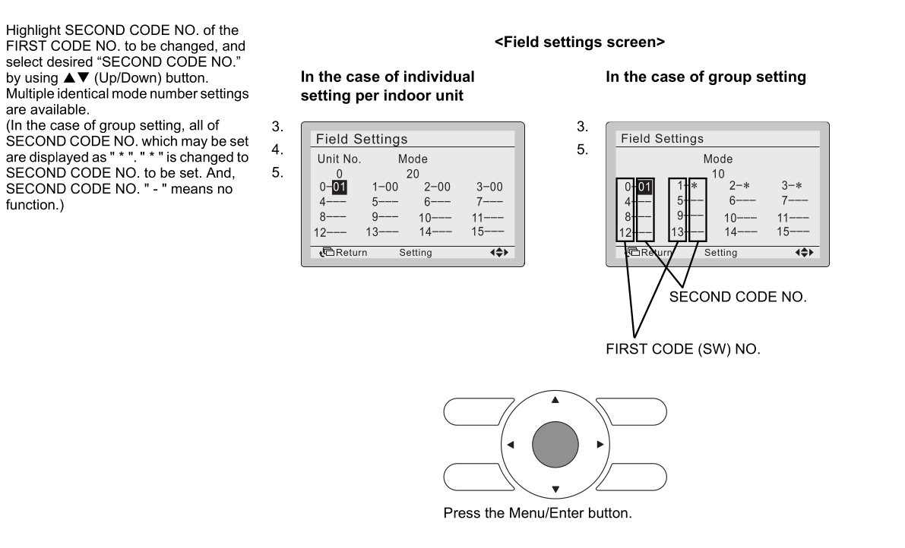
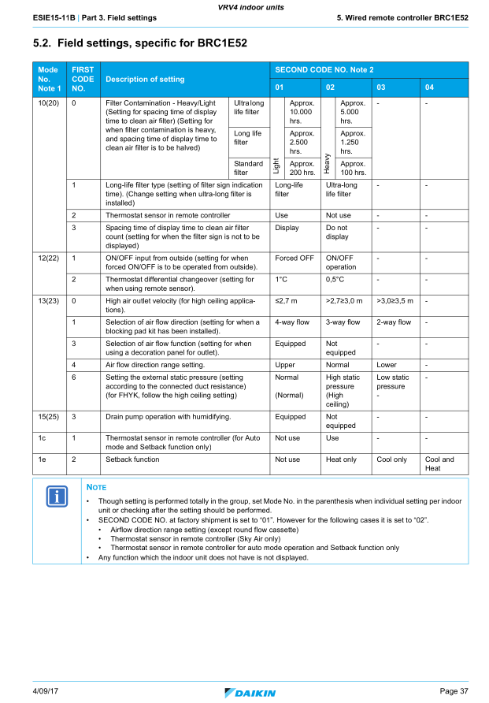
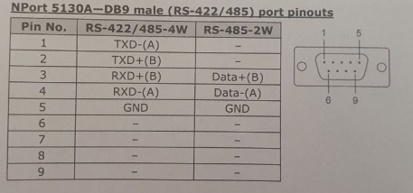
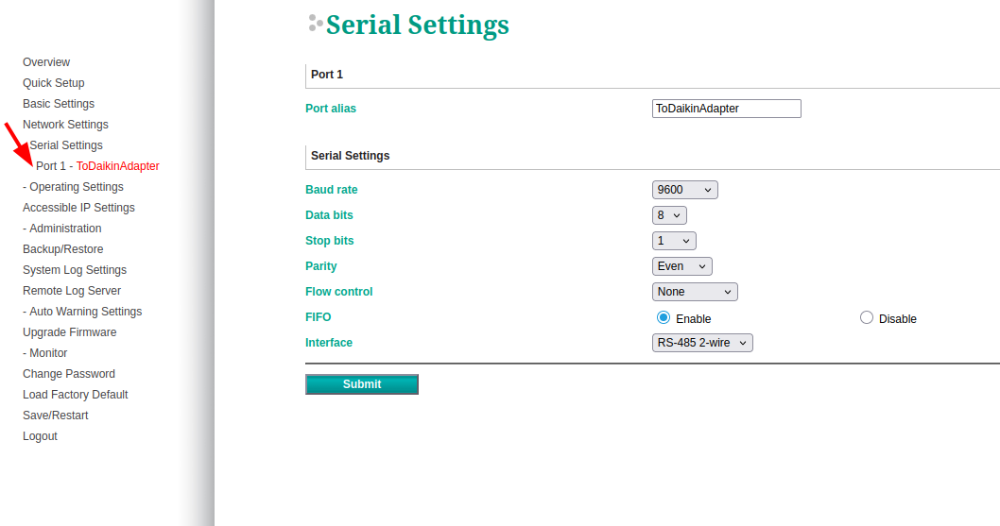
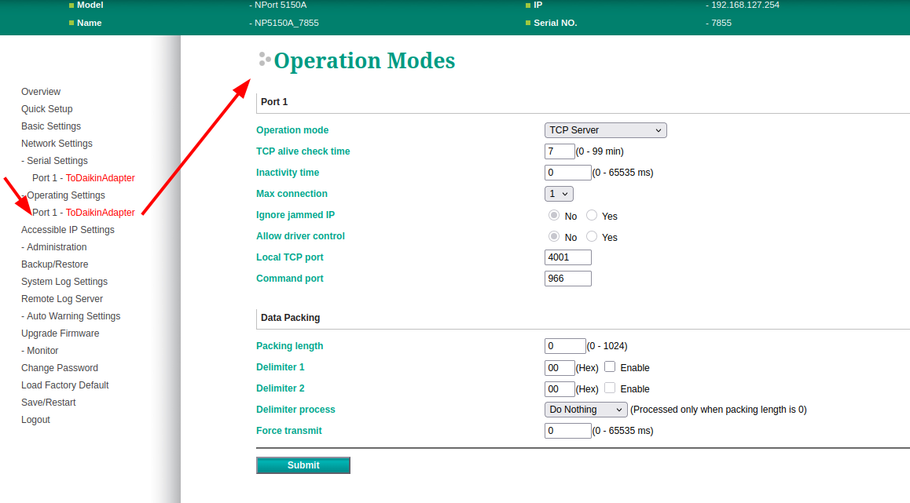

# Hardware

## 1. Physical Configuration of the Daikin DTA (DTA116A51) Board
Ensure the Aircon installer configures the **DS1** and **DS2** switches on the DTA board exactly as shown below:

**DS1 (DIP Switches):**
- **1:** OFF
- **2:** OFF
- **3:** OFF
- **4:** OFF

**DS2 (DIP Switches):**
- **1:** OFF
- **2:** OFF
- **3:** OFF
- **4:** ON

This configuration sets the DTA with:
- **MODBUS Enabled**
- **MODBUS Slave Address:** 1
- **Serial Speed:** 9600 bps
- **Data Bits:** 8 bit
- **Stop Bit:** 1
- **Parity:** Even

These switches are clearly labeled on the DTA board:

Refer to the installation manual for verification:

### 2. Configuration of DIII-Net Addresses
Each indoor unit (head unit) must have a unique DIII-Net address. This allows the DTA board to send commands to each unit individually.

**Address Format:** `X-YY`
- **(First Code):** Must be a single digit from `1` to `4`
- **YY (Second Code / Unit Number):** Can be `00` to `15`.
- **Example Addresses:** `1-00`, `1-01`, `2-12` `4-15`, etc.

This process involves two stages and must be followed strictly in order.

#### Stage 1: Field Settings Configuration
Repeat these steps for **each** indoor unit using its respective Daikin remote:

1.  **Enter Field Setting Mode:** Use the Daikin remote connected to the unit.

*Familiarize yourself with the Daikin jargon:*

2.  **Set Group Address:**
    - Navigate to the **Group Address** menu.
    - Set a unique address for this unit (e.g., `1-00` for the first unit, `1-01` for the second).
    - **Note down which room this unit controls.** You will need this later for Home Assistant configuration.

3.  **Enable DTA Control:**
    - Return to the first page.
    - Select **Field Settings** and navigate to **Mode 22**.
    - Set **Parameter 1-02**. **Do not change any other settings.**

    *Reference from the BRC1E52 remote manual:*

    

#### Stage 2: System Power Cycle
Once all units are configured, you must reset the system to initialize communication:

1.  **Turn OFF** all air conditioning switches at your home’s electrical switchboard.
2.  **Verify** that all indoor and outdoor units are completely powered off.
3.  **WAIT:** Wait for at least **5 minutes**. This is critical to reset the memory and re-initialize communications.
4.  **Turn ON** all switches at the electrical switchboard.
5.  **WAIT:** Wait another **5 minutes** for the DTA to establish communication with all units.

### 3.A Modbus TCP -> Modbus RTU Gateway

If your Gatreway provides "Modbus RTU" this is one equipment option:

To communicate with the DTA116A51 I have used a [Waveshare RS232/485 TO WIFI POE ETH (B)](https://www.waveshare.com/wiki/RS232/485_TO_WIFI_POE_ETH_(B)) interface which provides a Wifi or Ethernet Modbus TCP gateway to the DTA116A51's RS485 interface.

The Waveshare interface must be configured in Modbus TCP<=>Modbus RTU mode.

#### Mounting

I bought my DTA116A51 from AliExpress, probably used. It came with the power supply and some cables but no housing.

The DTA116A51, Waveshare and power supply are mounted in a case near one of the indoor units.

#### Wiring

Daikin documentation states that

- the DTA116A51 should be connected to the outdoor unit on the outdoor F1F2 bus to minimise outages due to problems on the indoor bus.
- the F1F2 bus should not branch, but should chain from device to device.

As I have added the DTA116A51 to an existing installed system I wanted to avoid changing the system's wiring configuration. I found that I could piggyback attach the DTA116A51 to an existing indoor unit's F1F2 connection on the indoor F1F2 bus, branching it on a short cable, and the gateway and system have been performing reliably for a number of months.

### 3.B Modbus RTU -> Modbus RTU over TCP Gateway
If your Gatreway provides "Modbus RTU over TCP" (encapsulated RTU) this is one equipment option.  

⇒ Moxa NPort 5150A. It echoes serial data over a TCP connection.

**Hardware Setup:**
Connect the Moxa device to your network (Ethernet) and to the DTA MODBUS port.
*Pinout reference:*

**Software Configuration:**
1.  **Login:** Open a web browser and navigate to the Moxa device's IP address.
    - **Username:** `admin`
    - **Password:** `moxa` (default)

2.  **Serial Settings:** Navigate to **Serial Settings** and match the Daikin DTA parameters:

    

3.  **Operation Mode:** Navigate to **Operation Mode** and configure as shown:

    
